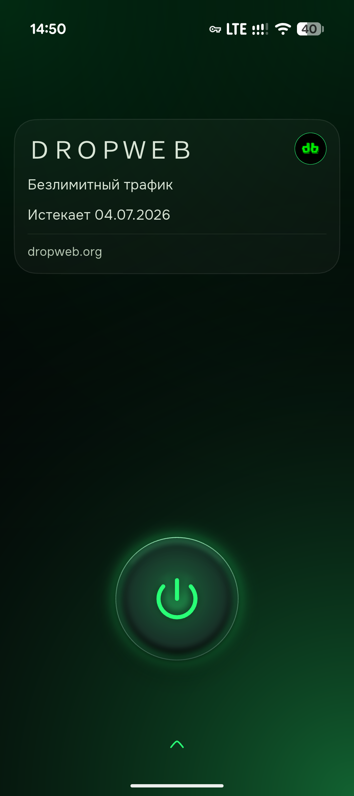
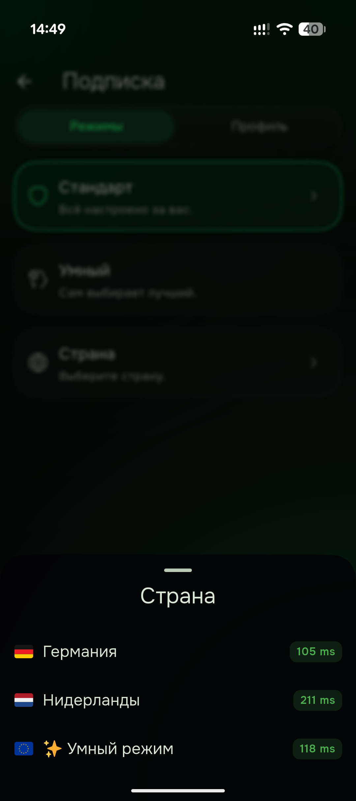
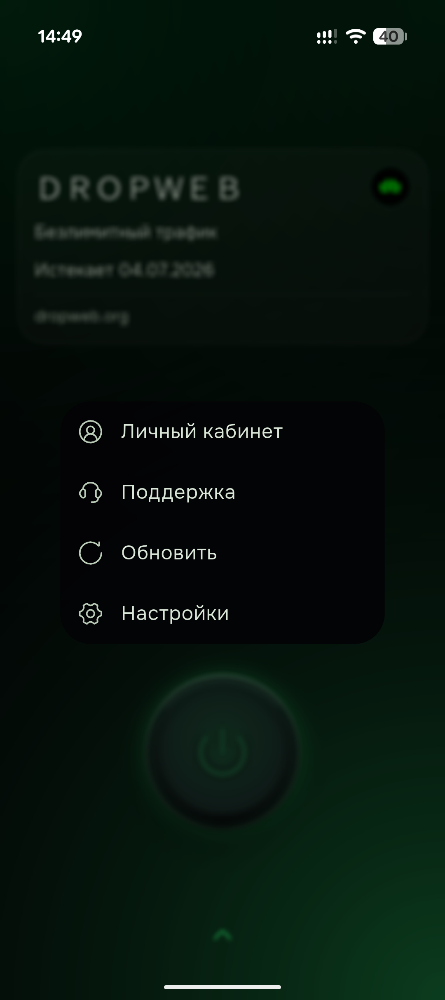

  <a href="README_EN.md">English</a>

<picture>
  <source media="(prefers-color-scheme: dark)" srcset="assets/images/wordmark-dark.png">
  
</picture>

 

---

**dropweb** — приватный VPN- и прокси-клиент для Android, Windows, macOS и Linux на ядре mihomo (Clash.Meta). Вы подключаете собственную конфигурацию; dropweb устанавливает соединение по ней и управляет маршрутизацией.

Команда dropweb придерживается принципов открытого кода, приватности по умолчанию и предсказуемого поведения на всех платформах. Журналы активности не ведутся; dropweb не предоставляет серверы и не вмешивается в трафик — конфигурации и ключи остаются на устройстве.

<table>
  <tr>
    <td></td>
    <td></td>
    <td></td>
  </tr>
</table>

---

##  Ключевые отличия

###  Защита от утечки на устройстве

Большинство клиентов держат открытый локальный прокси-порт, к которому может обратиться любое приложение на том же устройстве — это потенциальный канал утечки вашего IP. На мобильных платформах dropweb закрывает его по умолчанию: случайный порт при каждом запуске, обязательная аутентификация прокси и маршрутизация только через TUN-интерфейс без отдельных слушателей. Локальный прокси недоступен другим приложениям на устройстве.

###  Интеллектуальный выбор маршрута

Режим **«Умный»** опирается на ML-модель ядра (LightGBM): она прогнозирует оптимальный узел по реальным метрикам соединения вместо постоянных контрольных пингов. Это снижает число фоновых опросов; выбор узла не требует ручной настройки.

###  Современные TLS-профили

dropweb формирует TLS-рукопожатие исходящих соединений по профилю актуального браузера, включая кастомные профили **Firefox 148** и **Safari 26** с пост-квантовым обменом ключами **X25519MLKEM768**. Таких профилей нет в апстрим-uTLS.

###  Устойчивость соединения

Опциональная функция повышает надёжность TLS-соединений на нестабильных и перегруженных сетях, разбивая начало рукопожатия на сегменты. Включается одним тумблером и не требует настройки.

###  Точный статус подключения

Индикатор становится активным только когда туннель установлен: ядро подтверждает готовность интерфейсу. Ложноположительное состояние «подключено» исключено — при сбое приложение возвращается в состояние «отключено».

---

##  Сравнение

| Возможность | dropweb | GUI на mihomo/Clash | GUI на Xray/sing-box |
|---|:---:|:---:|:---:|
| Защита приватности на устройстве (изоляция локального прокси) |  по умолчанию |  редко / опционально |  редко |
| Устойчивость TLS-соединения (фрагментация ClientHello) |  |  |  в ядре, обычно только через ручной JSON |
| Современные TLS-профили (Firefox 148 / Safari 26, пост-квант) |  |  только пресеты uTLS |  часто несовместимо |
| Интеллектуальный выбор маршрута (ML, LightGBM) |  режим «Умный» |  только через YAML |  |
| Режимы одним касанием (Стандарт / Умный / Страна) |  |  |  |
| Точный статус подключения (UI ждёт реального туннеля) |  |  |  |
| Android + Windows + macOS + Linux из одной кодовой базы |  | частично | редко |

 — есть из коробки ·  — частично / только вручную ·  — нет. Сравнение по состоянию экосистемы на 2026 год; многие функции существуют в ядрах, но не вынесены в интерфейс клиента.

---

##  Возможности

**Подключение**
- Импорт подписок по URL и QR-коду, фоновое авто-обновление
- Режимы работы одним касанием: **Стандарт**, **Умный** (ML), **Страна** (весь трафик через выбранную страну)
- Каскадные маршруты и резервный пул узлов
- Протоколы ядра: VLESS (Reality / Vision / XHTTP), VMess, Trojan, Hysteria2, TUIC, ShadowTLS, AnyTLS, WireGuard
- Импорт конфигураций sing-box

**Приватность и безопасность**
- Изоляция локального прокси: случайный порт + аутентификация, маршрутизация только через TUN
- Современные TLS-профили с пост-квантовым обменом ключами
- Опциональная фрагментация TLS для устойчивости соединения
- Маршрутизация по правилам, geosite/geoip, split tunneling по приложениям
- Ядро mihomo (Clash.Meta) с актуальными исправлениями безопасности (DoS/OOB) из mihomo v1.19.27

**Интерфейс**
- Тёмная тема **Lumina**; рендеринг оптимизирован для устройств среднего класса
- Родной системный трей на Windows/Linux и статус-бар на macOS
- Независимая доставка обновлений

---

##  Эффективность и надёжность

Потребление батареи и памяти снижено относительно типового клиента на ядре mihomo за счёт ряда специфических оптимизаций.

**Батарея и фон**
- Фоновые опросы прокси-групп останавливаются, когда приложение свёрнуто — пробуждения каждые 20 секунд устранены
- Рендеринг интерфейса приостанавливается в фоне
- Сеть обновляется только при включении экрана — меньше пробуждений радио и процессора
- Режим «Умный» не гоняет постоянные контрольные пинги по серверам
- Исключение из энергосбережения запрашивается контекстно — только после первого успешного подключения

**Память и стабильность**
- Ограничение Go-кучи (мягкий лимит 192 МБ + ранний сборщик мусора) — предсказуемый расход ОЗУ на среднем железе
- Защита ядра от паник: сбой в отдельной горутине не роняет VPN-процесс
- Кэш конфигурации — мгновенные переключения без переинициализации ядра
- Атомарная запись профилей и ленивая загрузка geodata

**Сборка для современного Android**
- 16-КБ выравнивание страниц памяти — совместимость с новыми устройствами и требованиями Google Play
- minSdk 24 и строгая (fail-closed) подпись релиза

---

##  Кастомизация под провайдера

Оператор подписки задаёт оформление и поведение клиента через HTTP-заголовки ответа подписки — без отдельной сборки и форка. Один бинарник поддерживает брендинг нескольких провайдеров.

Через заголовки `dropweb-*` оператор может настроить:

- **Тему одной строкой** — акцентный цвет, два цвета фоновых орбов, фильтр цветовой схемы и размытость (`dropweb-theme`)
- **Логотип и название сервиса** на карточке подписки (`dropweb-logo`, `dropweb-servicename`)
- **Личный кабинет и управление подпиской** — ссылка на кабинет и контекстные действия (`dropweb-cabinet`)
- **Аварийный резервный пул** узлов на случай недоступности основных (`dropweb-disconeko`)
- **Объявления и метаданные** сервиса (`announce`, `support-url`)

Пользователь сохраняет контроль над оформлением: тумблеры **«Тема из подписки»** и **«Лого из подписки»** (по умолчанию включены) в любой момент возвращают вид по умолчанию; при выключенных тумблерах значения оператора не применяются.

---

##  Приватность

dropweb — клиент: серверную инфраструктуру приложение не предоставляет. Вы подключаете собственную конфигурацию (подписку), по которой устанавливается соединение. Вмешательство в трафик и реклама отсутствуют, журналы сетевой активности не ведутся. Конфигурации и ключи хранятся в защищённом хранилище на устройстве и не передаются.

---

##  Открытый код

dropweb распространяется под лицензией **GPL-3.0** — исходный код полностью открыт и доступен для аудита. Проект основан на FlClashX (форк FlClash) и использует ядро mihomo (Clash.Meta); мы благодарны их авторам и сообществу.

- FlClashX (© pluralplay) — https://github.com/pluralplay/FlClashX
- FlClash (© chen08209) — https://github.com/chen08209/FlClash
- mihomo / Clash.Meta (© MetaCubeX) — https://github.com/MetaCubeX/mihomo

---

##  Сообщество

- [Telegram-форум для обсуждений](https://t.me/+gnnahAxAtisxZmVi)

##  Лицензия

GPL-3.0 — см. [LICENSE](LICENSE).

---

dropweb — инструмент для приватности и безопасности личного трафика. Порядок использования определяется законодательством вашей страны; ответственность за использование несёт пользователь.
