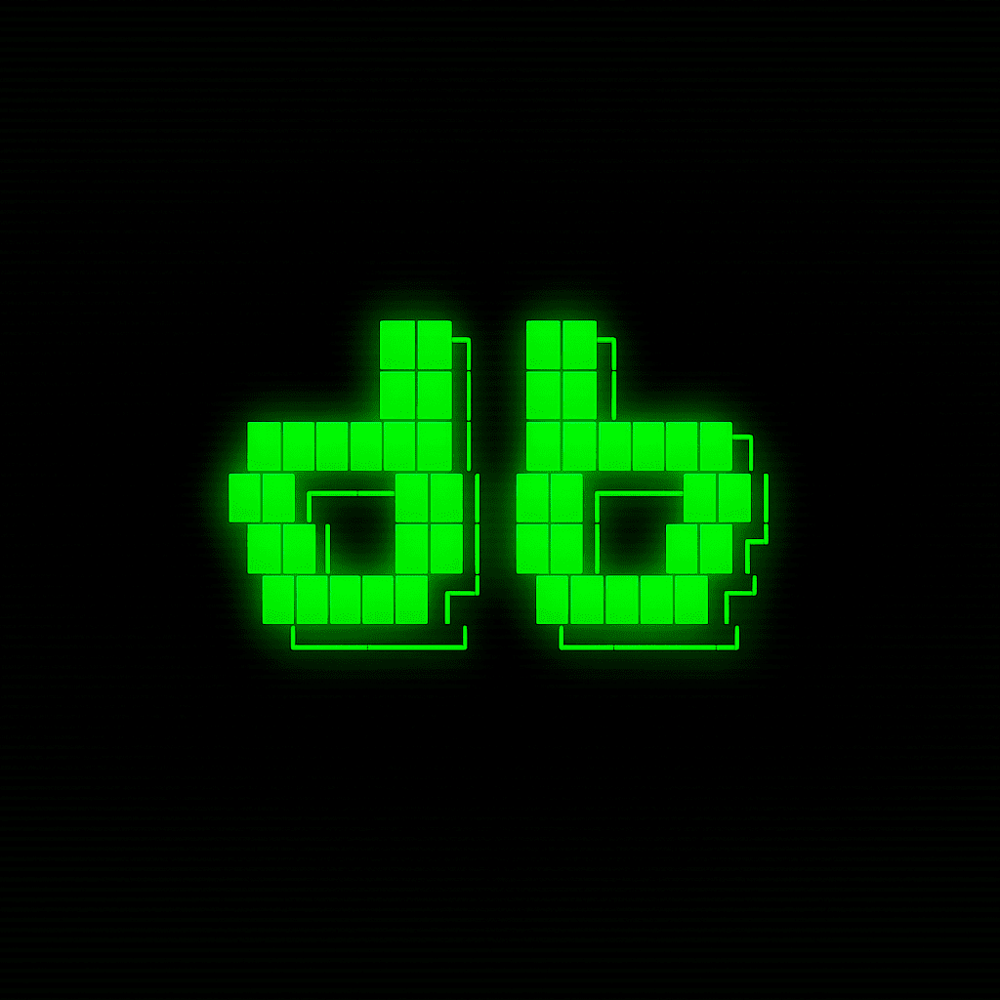

  <a href="README.md">Русский</a>

  

# dropweb

 

---

**dropweb** is a private VPN and proxy client for Android, Windows, macOS and Linux, built on the mihomo (Clash.Meta) core. You connect your own configuration; dropweb establishes the connection and handles routing.

The dropweb team follows open-source principles, privacy by default, and predictable behavior across every platform. No activity logs are kept; dropweb does not provide servers and does not interfere with traffic — configurations and keys remain on the device.

<table>
  <tr>
    <td></td>
    <td></td>
    <td></td>
  </tr>
</table>

---

##  Key differentiators

###  On-device leak protection

Most clients keep an open local proxy port that any app on the same device can reach — a potential channel for leaking your IP. On mobile, dropweb closes it by default: a random port on every launch, mandatory proxy authentication, and routing through the TUN interface only, with no separate listeners. The local proxy is not reachable by other apps on the device.

###  Intelligent route selection

The **Smart** mode relies on the core's ML model (LightGBM): it predicts the best node from real connection metrics instead of constant probe pings. This reduces background polling; node selection requires no manual tuning.

###  Modern TLS profiles

dropweb shapes the TLS handshake of outbound connections after a current browser profile, including custom **Firefox 148** and **Safari 26** profiles with the post-quantum **X25519MLKEM768** key exchange. These profiles are not available in upstream uTLS.

###  Connection resilience

An optional feature improves the reliability of TLS connections on unstable and congested networks by splitting the initial handshake into segments. Enabled via a single toggle; no additional configuration required.

###  Accurate connection state

The indicator becomes active only when the tunnel is established: the core confirms readiness to the UI. False "connected" states are not possible; on failure, the app rolls back to the disconnected state.

---

##  Comparison

| Capability | dropweb | mihomo/Clash GUIs | Xray/sing-box GUIs |
|---|:---:|:---:|:---:|
| On-device privacy (local proxy isolation) |  by default |  rare / optional |  rare |
| TLS connection resilience (ClientHello fragmentation) |  |  |  in the core, usually manual JSON only |
| Modern TLS profiles (Firefox 148 / Safari 26, post-quantum) |  |  uTLS presets only |  often incompatible |
| Intelligent route selection (ML, LightGBM) |  Smart mode |  YAML only |  |
| One-tap modes (Standard / Smart / Country) |  |  |  |
| Accurate connection state (UI waits for the real tunnel) |  |  |  |
| Android + Windows + macOS + Linux from one codebase |  | partial | rare |

 — out of the box ·  — partial / manual only ·  — none. Comparison reflects the ecosystem as of 2026; many features exist in the cores but aren't surfaced in the client UI.

---

##  Features

**Connectivity**
- Subscription import via URL and QR code, background auto-update
- One-tap work modes: **Standard**, **Smart** (ML), **Country** (route all traffic through a chosen country)
- Cascade routes and a fallback pool of nodes
- Core protocols: VLESS (Reality / Vision / XHTTP), VMess, Trojan, Hysteria2, TUIC, ShadowTLS, AnyTLS, WireGuard
- sing-box config import

**Privacy & security**
- Local proxy isolation: random port + authentication, routing through TUN only
- Modern TLS profiles with post-quantum key exchange
- Optional TLS fragmentation for connection resilience
- Rule-based routing, geosite/geoip, per-app split tunneling
- mihomo (Clash.Meta) core with up-to-date security fixes (DoS/OOB) from mihomo v1.19.27

**Interface**
- Dark **Lumina** theme; rendering performance is maintained on mid-range hardware
- Native system tray on Windows/Linux and status bar on macOS
- Independent update delivery

---

##  Efficiency & reliability

dropweb uses less battery and memory than comparable clients built on the same core, through targeted optimizations across the stack.

**Battery & background**
- Proxy-group polling stops when the app is backgrounded, eliminating the 20-second wakeup cycle
- UI rendering is paused in the background
- The network is refreshed only when the screen turns on — fewer radio and CPU wakeups
- Smart mode doesn't fire constant probe pings across servers
- The battery-optimization exemption is requested contextually — only after the first successful connection

**Memory & stability**
- Bounded Go heap (192 MB soft limit + earlier GC) — predictable RAM usage on mid-range hardware
- Core panic protection: a failure in one goroutine doesn't take down the VPN process
- Config caching — instant switching with no core re-initialization
- Atomic profile writes and lazy geodata loading

**Built for modern Android**
- 16 KB memory page alignment — compatible with new devices and Google Play requirements
- minSdk 24 and strict (fail-closed) release signing

---

##  Provider customization

An operator defines the client's appearance and behavior through the subscription response HTTP headers — no separate build, no fork. A single client binary can be branded independently for any number of operators.

Through `dropweb-*` headers an operator can set:

- **Single-header theme** — accent color, two background-orb colors, a color-scheme filter and blur (`dropweb-theme`)
- **Logo and service name** on the subscription card (`dropweb-logo`, `dropweb-servicename`)
- **Account area and subscription management** — a cabinet link and contextual actions (`dropweb-cabinet`)
- **An emergency fallback pool** of nodes for when the primary ones are unreachable (`dropweb-disconeko`)
- **Announcements and service metadata** (`announce`, `support-url`)

The user retains control of appearance: the **"Theme from subscription"** and **"Logo from subscription"** toggles (on by default) restore the default appearance at any time; operator-supplied values are not applied when these toggles are off.

---

##  Privacy

dropweb is a client: the app does not provide server infrastructure. You connect your own configuration (subscription), which the app uses to establish a connection. Traffic is not modified, no ads are shown, and no logs of network activity are retained. Configurations and keys are stored in on-device secure storage and are not transmitted.

---

##  Open source

dropweb is distributed under the **GPL-3.0** license — the source code is fully open and available for audit. The project is based on FlClashX (a fork of FlClash) and uses the mihomo (Clash.Meta) core; we are grateful to their authors and communities.

- FlClashX (© pluralplay) — https://github.com/pluralplay/FlClashX
- FlClash (© chen08209) — https://github.com/chen08209/FlClash
- mihomo / Clash.Meta (© MetaCubeX) — https://github.com/MetaCubeX/mihomo

---

##  Community

- [Telegram discussion forum](https://t.me/+gnnahAxAtisxZmVi)

##  License

GPL-3.0 — see [LICENSE](LICENSE).

---

dropweb is a tool for the privacy and security of your own traffic. Permitted use is defined by the laws of your country; the user is responsible for how the app is used.
